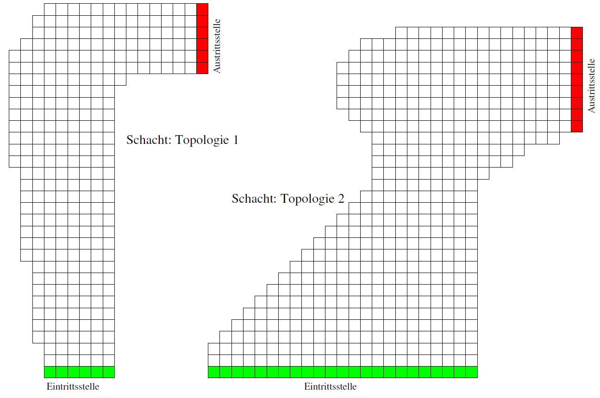
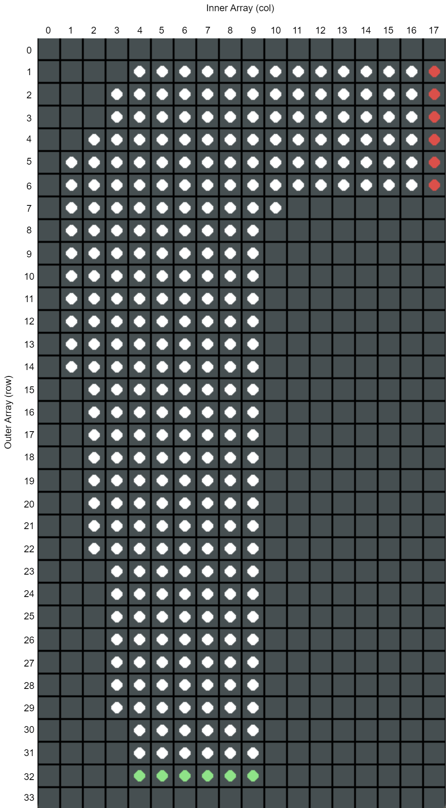
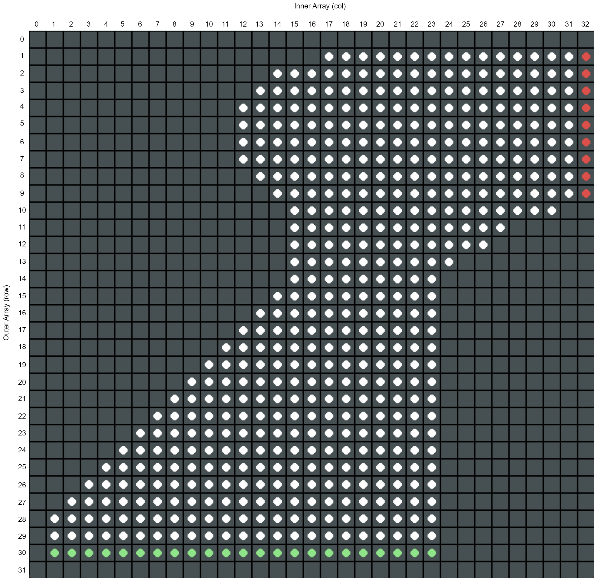

# X-Wing Figher Control

Zielstellung für ihren lernfähigen Agenten muss es sein, den Schacht so schnell wie möglich zu durchfliegen und zur Austrittsstelle zu gelangen. Selbstverständlich sollen dabei Berührungen mit den Schachtwänden vermieden werden. 

Der Flieger befindet sich zu jedem Zeitpunkt in einer diskreten Zelle des in der unteren Abbildung dargestellten Gitters; seine Geschwindigkeit ist ebenfalls diskret und gibt an, um wie viele Gitterzellen der Flieger pro Zeitschritt in x- sowie in y-Richtung weiterbewegt wird. => **pos, velocity**

Die zur Verfügung stehenden Aktionskomponenten sind Beschleunigen (B), Geschwindigkeit halten (H) und Verlangsamen (V). Hierbei gilt, dass jede Aktion sich durch eine Aktionskomponenten in x- sowie in y-Richtung auszeichnet und die Geschwindigkeit in die jeweilige Richtung um eine Einheit erhöht (B), konstant lässt (H) oder aber um eine Einheit reduziert (V). Die Menge aller Aktionen umfässt somit 9 Elemente. => **ACTIONS**

Zur Vereinfachung ist der Wertebereich möglicher Geschwindigkeiten auf positive Werte und Wert kleiner fünf eingeschränkt (also [0, 4]). => **get_new_velocity()**

Außerdem ist es (mit Ausnahme des Startzustandes) untersagt, die Geschwindigkeit in beide Richtungen gleichzeitig auf 0 zu reduzieren. => **get_selectable_actions()**

Eine Episode beginnt in einem zufälligen gewählten Eintrittspunkt auf der Eintrittslinie und endet beim überqueren der Austrittstelle. => **episode**

In jedem Zeitschritt, in dem der Agent im Schacht bleibt, erfährt er Kosten von 1, in jedem Zeitschritt, in dem er die Wand berührt, Kosten von 5. => **change_state()**

Berührungen mit der Wand resultieren nicht in einer Zerstörung der Raumschiffs, sondern darin, dass das Schiff nur um eine Gitterzelle entlang der Wand weiterbewegt wird (horizontal und/oder vertikal). Unter diesen Voraussetzungen ist sichergestellt, dass alle denkbaren Strategien stets die Zielllinie erreichen. => **get_velocity_after_collision()**

Um die Aufgabenstellung etwas interessanter zu gestalten, nehmen wir an, dass in 50% der Zeitschritte die Bewegung entweder in horizontaler oder in vertikaler Richtung um einen Schritt weiter ausgeführt wird, als die aktuelle Geschwindigkeit es eigentlich vorschreiben würde. => **get_new_position()**

*Berechnen Sie für jeden möglichen Startzustand, also für jeden möglichen Eintrittspunkt auf der Eintrittslinie die optimale Strategie für Ihren X-Wing Fighter. Verwenden Sie hierzu den Algorithmus zur Monte-Carlo-Strategiebewertung, um Ihre aktuelle Strategie zu evalieren. Werten Sie dann im Rahmen der GPI (generalisierte Strategieiteration) Ihre Strategie gierig aus, um zu einer verbesserten Strategie zu gelangen. Wiederholen Sie Ihre Untersuchungen für beide Topologien des Todessterns.*

Experimentieren Sie, um festzustellen, wie viele Rollouts erforderlich sind, um die aktuelle Strategie hinreichend genau zu bewerten. => **num_episodes**

*Lassen Sie Ihren Fighter 100 Male die ermittelte optimale Strategie fliegen: Wie oft kommt er ohne Berührungen der Wände zum Ziel? Visualisieren Sie Ihre Ergebnisse auf ansprechende Art und Weise.* => **episode**

